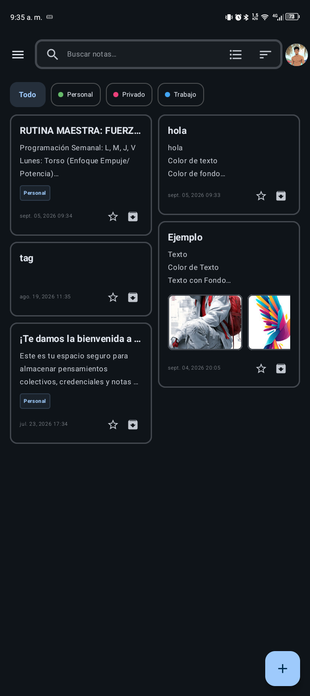
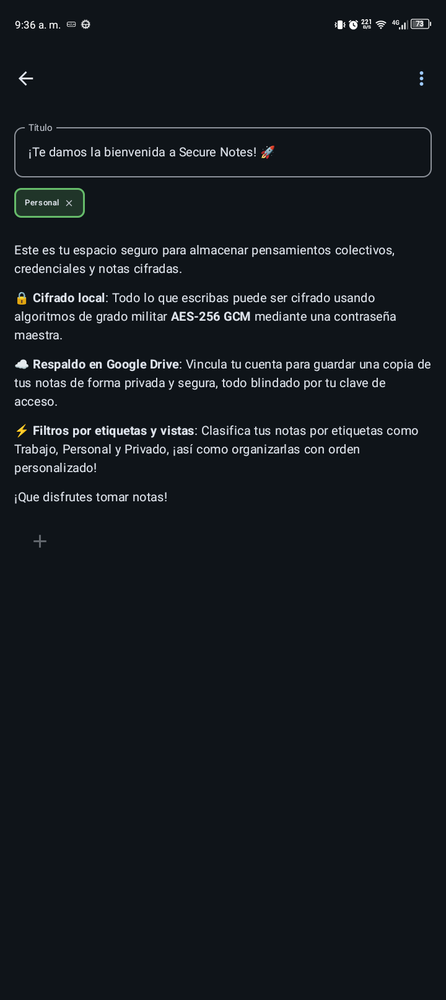
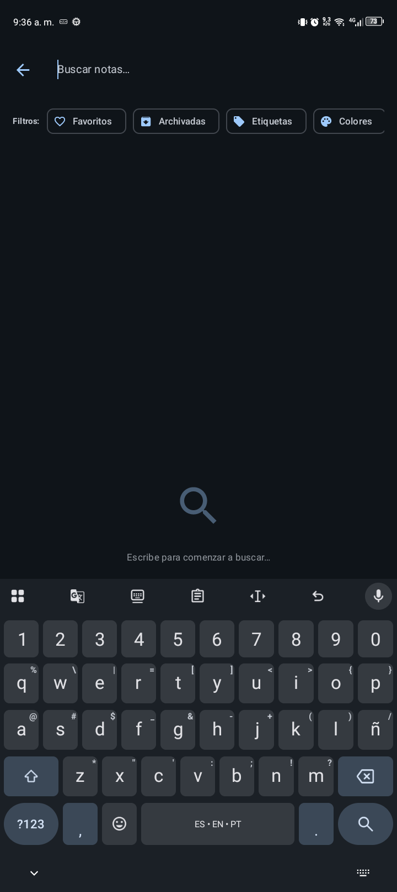
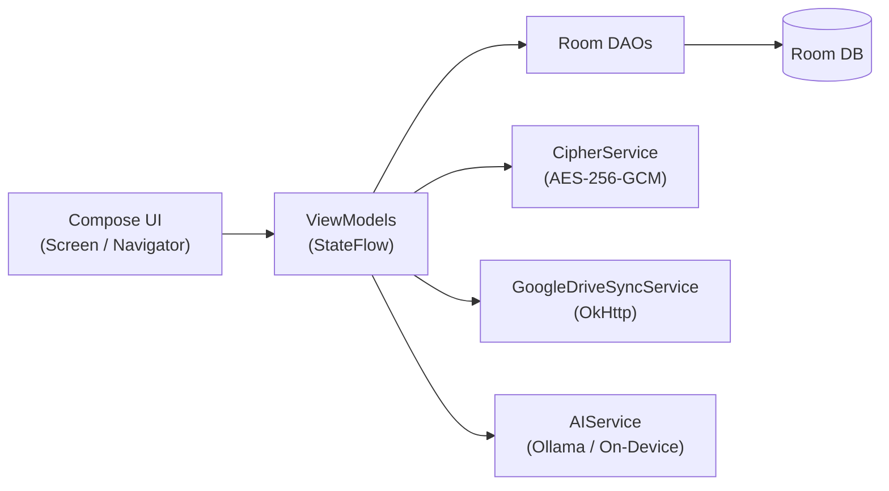

# Secure Notes

Bloc de notas Android con **cifrado real en el dispositivo**, **editor por bloques estilo Notion** e **IA 100 % local opcional**. Tus notas nunca salen sin cifrar y tus prompts jamás tocan la nube.

[](https://github.com/ESTRIN217/secure-notes/releases)


## Por qué existe

Notion es cómodo pero tus notas viven en sus servidores. Las apps de notas cifradas suelen tener editores pobres. Secure Notes une las tres cosas sin concesiones:

| Necesidad | Secure Notes |
|---|---|
| **Privacidad real** | AES-256-GCM + PBKDF2 (200 000 iteraciones). Salt e IV aleatorios por nota. Sin la contraseña maestra es matemáticamente imposible descifrar, ni siquiera para el desarrollador o Google. |
| **Editor a la altura** | WYSIWYG por bloques: títulos H1–H4, listas, checklists, tablas, citas, código con resaltado, LaTeX, imágenes, audio, dibujo, pestañas múltiples y menú `/`. |
| **IA sin nube** | Chat opcional (desactivado por defecto): llama.cpp on-device o Ollama/LM Studio en tu LAN. Cero APIs externas, cero entrenamiento con tus datos. |

## 📸 Capturas de Pantalla

<table align="center">
  <tr>
    <td align="center">
      
      <br><b>Vista Principal</b>
    </td>
    <td align="center">
      
      <br><b>Editor</b>
    </td>
    <td align="center">
      
      <br><b>Búsqueda y Filtros</b>
    </td>
  </tr>
</table>

---

## ✨ Características clave

* **Cifrado por nota** con contraseña maestra, biometría y pantalla de privacidad dedicada.
* **Editor por bloques** con formato enriquecido en línea, deshacer/rehacer, drag & drop y autoguardado.
* **Organización**: etiquetas, favoritos, archivadas, colores, drag & drop en rejilla y búsqueda en tiempo real (incluye cifradas con sesión abierta).
* **Multimedia**: imágenes, vídeo, audio, voz, archivos, dibujos y visor PDF integrado.
* **Sincronía opcional**: Google Drive (`appDataFolder`, cifrado antes de subir) + exportación TXT/Markdown/PDF/HTML/JSON.
* **IA local opcional**: chat con streaming, historial persistente, adjuntos de contexto y acciones (resumir, reescribir, traducir, corregir) insertables en la nota.
* **9 locales**, modo claro/oscuro, colores dinámicos, widgets y burbuja flotante.

> 📖 Manual del editor (bloques, gestos, sintaxis): [docs/EDITOR.md](docs/EDITOR.md) · Guía de desarrollo del editor: [docs/EDITOR_DEV.md](docs/EDITOR_DEV.md)

---

## 🌎 Idiomas soportados

Español (VE), Español (ES), Español (419), Português (BR/PT), Français, Italiano, English (US/GB). Las secciones legales están traducidas en todos los locales.

---

## 🏗️ Arquitectura de un vistazo



MVVM de un solo módulo (`:app` + módulos propios `:visor-pdf`, `:visor-media`, `:code-tools` y binding `:lib`), DI manual por `ViewModelProvider.Factory`, sin frameworks. Detalle completo: [docs/ARCHITECTURE.md](docs/ARCHITECTURE.md) · Principios: [docs/GUIDELINES.md](docs/GUIDELINES.md).

---

## 📋 Requisitos previos

| Herramienta | Versión |
|---|---|
| JDK | 17 |
| Gradle / AGP / Kotlin | 9.5.1 / 9.3.1 / 2.4.10 |
| Android SDK | `compileSdk 37`, `targetSdk 36`, `minSdk 33` |
| NDK / CMake (solo IA on-device) | 30.0.14904198 / 4.3.0 |
| llama.cpp checkout | commit `3dc7285b4` en la ruta que indica `settings.gradle.kts` (`:lib`), o ajusta `projectDir` |
| Firma | `key.properties` (copia desde `key.properties.template`) |
| Google (solo sync/Drive) | `app/google-services.json` |

> Solo se compila `arm64-v8a`. El plugin de secretos lee `.env` (ver `.env.example`); hoy ningún secreto es consumido: la IA no usa API keys.

## 🚀 Instalación y guía rápida

```bash
git clone https://github.com/ESTRIN217/secure-notes.git
cd secure-notes
cp key.properties.template key.properties   # completa tus datos de firma
# (opcional, solo Drive) coloca tu app/google-services.json
sh gradlew assembleDebug                     # APK en app/build/outputs/
sh gradlew test                              # unitarios + Robolectric + Roborazzi
```

Si el build se comporta raro (caché de configuración o KSP), `sh gradlew clean --no-configuration-cache`.

## 🗂️ Estructura del proyecto

```
secure-notes/
├── app/                 # :app — UI, ViewModels, Room, cifrado, IA, sync
│   └── src/main/{java/com/example/{ui,data,util},res,assets}
├── visor-pdf/           # :visor-pdf — visor PDF (PdfRenderer + androidx.pdf)
├── visor-media/         # :visor-media — galería audio/vídeo (Media3 + Coil3)
├── code-tools/          # :code-tools — editor de código con resaltado
├── docs/                # EDITOR, EDITOR_DEV, GUIDELINES, ARCHITECTURE, ROADMAP, adr/
├── .github/             # CI + plantillas de issues/PRs
├── CHANGELOG.md         # historial por versión (Keep a Changelog)
├── THIRD-PARTY-NOTICES  # licencias runtime distribuidas en el APK
└── LICENSE              # MIT
```

---

## ⚖️ Términos, privacidad e IA (resumen)

La fuente de verdad legal vive en la app (**Ajustes > Legal**), traducida a los 9 locales:

- **Términos**: app "tal cual"; tú custodias tu contraseña maestra (si la pierdes, nadie puede recuperar tus notas).
- **Privacidad**: cifrado/descifrado exclusivamente en tu dispositivo; backups cifrados antes de subir.
- **IA**: opcional, desactivada por defecto, on-device o LAN; jamás nube ni entrenamiento externo.
- **Drive**: opcional, carpeta privada `AppData`, OAuth 2.0, revocable en Ajustes.
- **Licencias OSS**: Ajustes > Legal > Licencias (fuente: `app/src/main/assets/oss-licenses.json`).

Para reportar vulnerabilidades de forma privada, ver [SECURITY.md](SECURITY.md).

---

## 🤝 Contribución y licencia

Lee [CONTRIBUTING.md](CONTRIBUTING.md) (estilo, tests, flujo de PRs) y el [CHANGELOG.md](CHANGELOG.md). Decisiones de diseño: [docs/adr/](docs/adr/). Dependencias y sus licencias: [THIRD-PARTY-NOTICES](THIRD-PARTY-NOTICES).

Este proyecto está licenciado bajo la Licencia MIT — ver [LICENSE](LICENSE).

---

<p align="center">
  Desarrollado con pasión por <b>ESTRIN217</b>.
</p>

<p align="center">
  Hecho con ❤️ en Venezuela.
</p>
