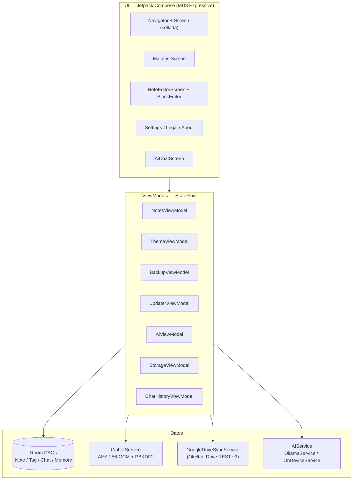

# Arquitectura — Secure Notes

> Complementa `AGENTS.md` (mapa operativo de capas y ficheros) y `docs/GUIDELINES.md`
> (principios). Este documento explica el **flujo de datos**, las **decisiones de estado**
> y los **módulos**.

## 1. Vista general

Un solo módulo de app (`:app`) más módulos propios: `:visor-pdf` (PDF),
`:visor-media` (audio/vídeo, Media3), `:code-tools` (editor de código) y `:lib`
(binding `llama.android`, compilado desde fuente, solo `arm64-v8a`).

## 2. Flujo de datos

1. **Lista**: `NotesViewModel` expone `notesList: StateFlow`; `MainListScreen` la
   consume con `collectAsStateWithLifecycle()`. Búsqueda y filtros se aplican en el
   ViewModel, no en la UI.
2. **Editor**: `NoteEditorScreen` mantiene `blocks: MutableList<DataBlock>` como estado
   local; `BlockEditor` es presentacional (controlado) y reporta cambios hacia arriba
   (`onBlocksChange`). El guardado persiste vía `NotesViewModel` → DAO → Room.
   Detalle del editor: `docs/EDITOR_DEV.md`.
3. **Cifrado**: al guardar una nota cifrada, el contenido (JSON de bloques) pasa por
   `CipherService` (salt + IV aleatorios por nota) antes de Room. Al leer, el
   descifrado ocurre solo con la sesión desbloqueada (contraseña en memoria).
4. **Sync**: `BackupViewModel` → `GoogleDriveSyncService` (REST v3 sobre OkHttp,
   carpeta `appDataFolder`); `SyncWorker` (WorkManager) ejecuta la sincronía periódica.
   Los respaldos se cifran **antes** de transmitirse.
5. **IA**: `AiViewModel` delega en `AIService` según backend; `OnDeviceService` envuelve
   `LlamaCppEngine` (singleton JNI con aislamiento por recarga); el historial vive en Room.

## 3. Decisiones de estado

* `StateFlow` + `collectAsStateWithLifecycle()` como único mecanismo reactivo.
* Estado de pantalla con clases dedicadas (`AuthState`, `ListState`, `SyncState`),
  no un sellado genérico.
* Sin repositorio (YAGNI): los ViewModels consumen DAOs directamente; interfaces solo
  donde hay sustitución real (`CipherService`, `PreferencesRepository`,
  `CloudSyncManager`, `AIService`).
* DI manual con `ViewModelProvider.Factory` en `MainActivity`; sin framework.
* Navegación con jerarquía sellada `Screen` + `Navigator` y persistencia de ruta
  (`ScreenSaver`); pestañas de notas con `OpenNoteTabs` (LRU, máx 10).

## 4. Patrones aplicados

* **MVVM** estricto: Composables puros, lógica en ViewModels, datos en DAOs/servicios.
* **SOLID**: ver tabla en `docs/GUIDELINES.md` (§3) con las clases reales.
* **Fuente de verdad única** por dominio: `richTextJson` (editor), `oss-licenses.json`
  (licencias), Room (persistencia).

## 5. Decisiones registradas (ADR)

* [ADR-0001](adr/0001-ia-local-sin-nube.md): IA local frente a APIs cloud.
* [ADR-0002](adr/0002-sin-repository-di-manual.md): sin repository, DI manual.
* [ADR-0003](adr/0003-licencias-centralizadas.md): licencias centralizadas en JSON.

## 6. Límites conocidos

* Room usa `.fallbackToDestructiveMigration()`: un cambio de esquema destruye datos.
  Ver roadmap para migraciones reales.
* El build de `:code-tools` está roto (`R` sin resolver en `CodeEditorView`); bloquea
  la compilación completa hasta su estabilización.
* El binding `llama.android` impone semántica singleton (ver `GUIDELINES.md` §10).
